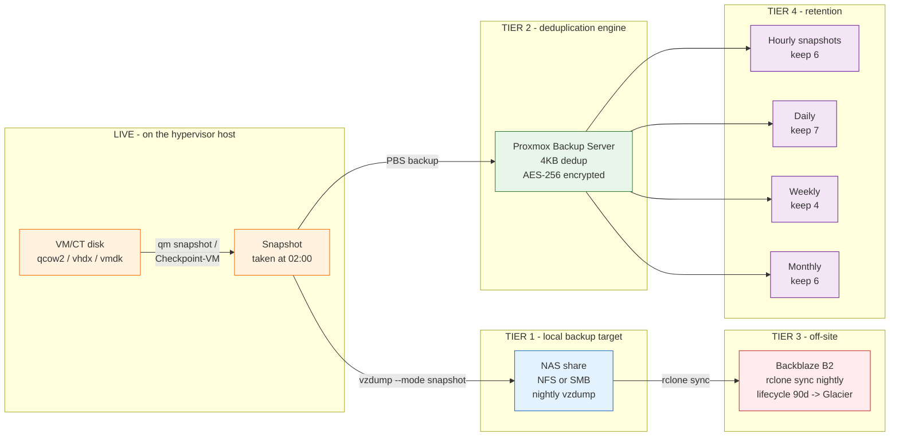

# Backup Data Flow

Where the bits go from "live VM" to "off-site, encrypted, deduplicated".

## Three Independent Copy Paths

| Path | Tool | Copies to | Schedule | Encryption |
|------|------|-----------|----------|------------|
| A | `vzdump` to NAS | NAS share | Nightly | At-rest NAS only |
| B | `pvesm backup` to PBS | PBS datastore | Nightly | Client-side AES-256 |
| C | `rclone sync` from NAS | B2 cloud bucket | Nightly | rclone crypt (B2 has SSE) |

If A fails (NAS dead), B is current. If A and B both fail, C is at
most 24 h old (RPO). If C fails, A and B are local. The 3-2-1 rule
is met by the union of these three paths.

## Why Both NAS and PBS?

They look redundant but solve different problems.

- **NAS** is the cheap, slow, full-copy archive. Easy to browse
  (`ls`), easy to restore with stock tools, no special client
  required. Use it for "I deleted the wrong file, give me last
  Tuesday's version" restores.
- **PBS** is the dedup engine. 500 GB of unique blocks in your VMs
  becomes 50 GB of backup storage after dedup. Use it for "the
  hypervisor host died, restore 8 VMs" emergencies.

You can skip PBS for a small lab (< 3 VMs). You cannot skip the
NAS. You cannot skip the off-site copy.
