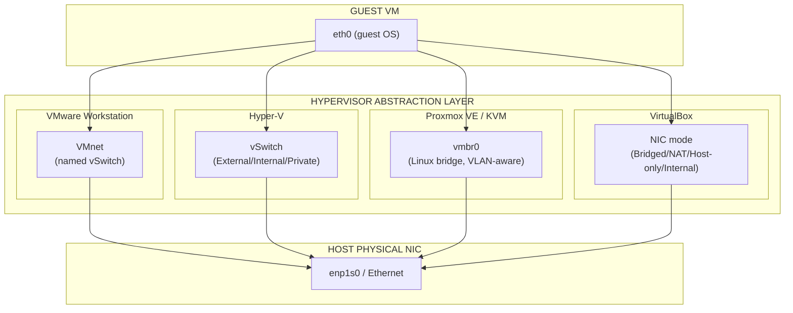
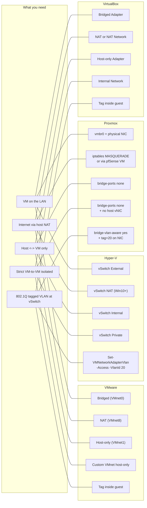

# Hypervisor Network Stack Comparison

How each hypervisor models a virtual network, side by side.

## Layered Model

## Concept-to-Command Map

## Key Takeaways

- **Proxmox wins for VLAN density** - one bridge, 4094 VLANs, no
  per-VM switch. The other three either require per-NIC VLAN config
  (Hyper-V) or punt VLAN tagging entirely to the guest (VMware,
  VirtualBox).
- **VMware wins for ergonomics** - VMnet0/1/8 defaults cover 80% of
  needs, the GUI makes the rest obvious, and `vmrun` is the only
  CLI that handles snapshots, power, and guest exec in one tool.
- **Hyper-V wins for Windows integration** - vSwitch binds to the
  Hyper-V virtual NIC stack, and PowerShell gives full access. The
  trade-off is that there's no equivalent of `vmrun guest exec` -
  you push commands via WinRM/PowerShell Direct instead.
- **VirtualBox wins for cross-platform portability** - same `.vbox`
  file works on Windows, Linux, macOS. That's why Vagrant defaults
  to it. The trade-off is no over-commit, so RAM ceiling = sum of
  fixed allocations.
