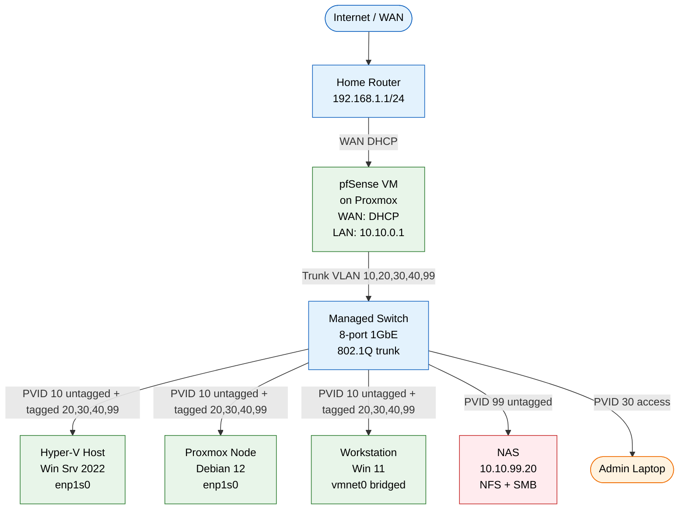

# Physical Topology

How every box, cable, and NIC in the lab is wired together.

## Notes

- The switch port to each hypervisor is an **802.1Q trunk** carrying
  all five VLANs. The PVID (untagged) is always the management VLAN
  (10) so the hypervisor's mgmt IP works without a tagged frame.
- The NAS is on a **dedicated access port** in VLAN 99 (Storage).
  It can talk to the rest of the lab but nothing talks *out* of it
  via VLAN 99.
- The admin laptop plugs into a **VLAN 30 access port** for normal
  client work. To reach the hypervisor mgmt plane, the laptop joins
  VLAN 10 (or routes through pfSense if policy allows).
- pfSense is the only host with one foot in the WAN (via the home
  router) and one foot in the lab trunk. If pfSense is down, VMs
  can still talk to each other on the same VLAN but cannot reach
  other VLANs or the internet.
